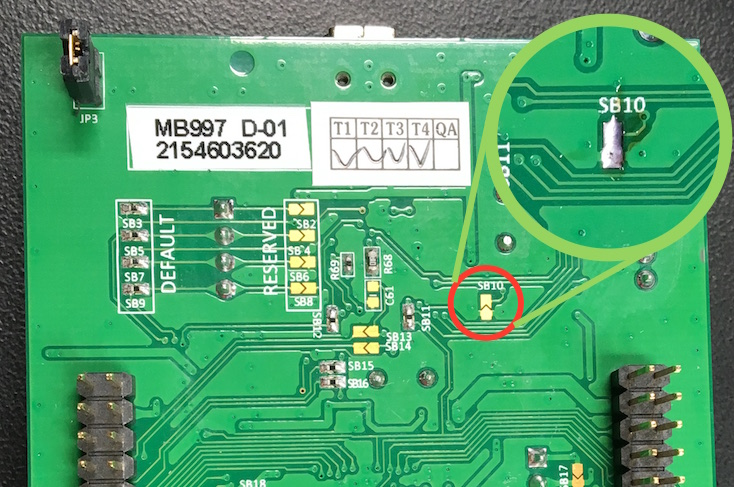

#Silta - Python to STM32F4 Bridge Project

## Firmware Download
If you don't want to build the firmware and prefer downloading it, check out the github releases page: https://github.com/alvarop/silta/releases

## Firmware Build instructions

Make sure you have the arm-none-eabi(gcc, etc...) tools installed: https://launchpad.net/gcc-arm-embedded

Running make on the top directory should build both the driver library, support files, and main.c
Output files are in the build/ directory

## Programming instructions

### Using dfu-util

1. Install dfu-util using your favorite package manager (e.g. 'brew install dfu-util' on OSX)
2. Connect to the stm32f4-discovery board using the micro USB cable
3. Connect PA9 to 5V to power up the board
4. Temporarily connect BOOT0 and VDD and hit the reset button, this will bring up the USB DFU bootloader
5. Run `dfu-util -d 0483:df11 -c 1 -i 0 -a 0 -s 0x8000000 -D fw/build/silta.bin`
6. Disconnect BOOT0 and VDD and reset the board again

### NOTE for STM32F407G-Discovery Rev D
For some reason, the st-link firmware changed for revision D of the discovery board. It will hold the STM32F407 in reset until the ST-Link microcontroller connects to a computer via USB. This prevents using the PA9->5V connection to power the board from the micro-usb connector.

A simple solution is to solder short SB10 on the back of the board. This will hold the ST-Link microcontroller in reset and release the STM32F407. This will disable ST-Link, so only do this if you plan to use the dfu-util firmware update method.

### Using openOCD and gdb

1. Connect to the stm32f4-discovery board using the mini USB cable AND micro USB cable
2. Connect using openOCD and the included configuration file.
	`$ openocd -f stm32f4xx-openOCD.cfg`
3. On a separate terminal window, run arm-none-eabi-gdb
	`$ arm-none-eabi-gdb`
4. Connect to openOCD
	`(gdb) target extended-remote localhost:3333`
5. Load program the stm32f4xx
	`(gdb) file build/silta.elf`
	`(gdb) load`
6. To run you program:
	`(gdb) continue`
